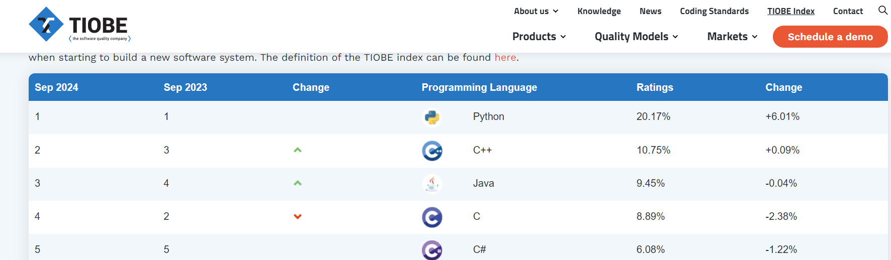

# Los 5 lenguajes más utilizados en la actualidad

[Enlace a la web](https://www.tiobe.com/tiobe-index/)
---
## 1r. Python
---
| <!-- -->             |<!-- --> |
|----------------------|---------|
|**Nivel de abstracción**  | Alto    |
|**Propósito**             | General   |
|**Compilado / Interpretado**  | Interpretado    |
|**Paradigmas de programación** | Estructurada    |

---
## 2n. C++
---
| <!-- -->             |<!-- --> |
|----------------------|---------|
|**Nivel de abstracción**  | Intermedio   |
|**Propósito**            | General   |
|**Compilado / Interpretado**  | Compilado    |
|**Paradigmas de programación** | Orientada a objetos    |
---
## 3r. Java
---
| <!-- -->             |<!-- --> |
|----------------------|---------|
|**Nivel de abstracción**  | Alto   |
|**Propósito**           | General   |
|**Compilado / Interpretado**  | Interpretado y compilado   |
|**Paradigmas de programación** | Orientada a objetos    |
---
## 4t. C
---
| <!-- -->             |<!-- --> |
|----------------------|---------|
|**Nivel de abstracción**  | Intermedio   |
|**Propósito**            | General   |
|**Compilado / Interpretado**  | Compilado  |
|**Paradigmas de programación** | Procedimental    |
---
## 5t. C``#``
---
| <!-- -->             |<!-- --> |
|----------------------|---------|
|**Nivel de abstracción**  | Intermedio   |
|**Propósito**            | General   |
|**Compilado / Interpretado**  | Compilado  |
|**Paradigmas de programación** | Orientada a objetos   |

