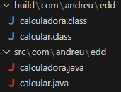
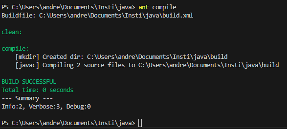
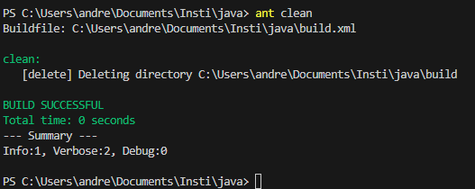
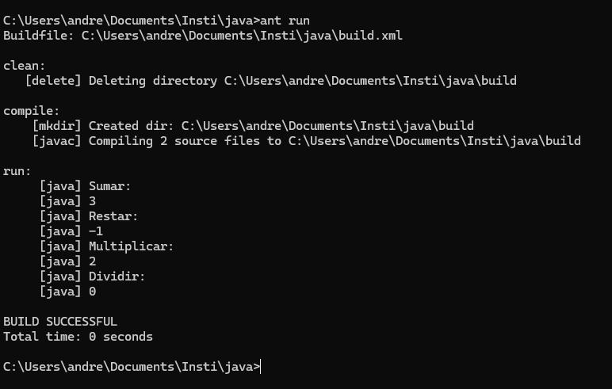

# Actividad calculadora

## Estructura



## Funciones (calcular)
```java
package com.andreu.edd;  
public class calcular {  
    public static void sumar(int a, int b) {  
        System.out.println("Sumar:");  
        System.out.println(a + b);  
    }  
    public static void restar(int a, int b) {  
        System.out.println("Restar:");  
        System.out.println(a - b);  
    }  
    public static void multiplicar(int a, int b) {  
        System.out.println("Multiplicar:");  
        System.out.println(a * b);  
    }  
    public static void dividir(int a, int b) {  
        System.out.println("Dividir:");  
        System.out.println(a / b);  
    }  
}  
```

## Clase main (calculadora)

```java

package com.andreu.edd;

public class calculadora {
    public static void main(String[] args) {
        int num1 = 1, num2 = 2;
        calcular.sumar(num1, num2);
        calcular.restar(num1, num2);
        calcular.multiplicar(num1, num2);
        calcular.dividir(num1, num2);
    }
}
```

## Obtener y ejectar .class

> PS C:\Users\andre\Documents\Insti\java> javac -d build -classpath build .\src\com\andreu\edd\*  

Con la opcion "-d"  decimos el directorio donde queremos que se guarden los .class (archivos compilados). Y la opcion "--classpath" especificamos donde estan guardadas las clases a utilizar.

> PS C:\Users\andre\Documents\Insti\java> java -cp build com.andreu.edd.calculadora  


## Resultado

Sumar:  
3  
Restar:  
-1  
Multiplicar:  
2  
Dividir:  
0  

## Java con Ant

Nos descargamos e instalamos *Java con Ant* desde la  [pagina oficial de Ant](https://ant.apache.org).
Nos instalamos el extension "Ant Target Runner" para poder utilizarlo de buena forma en Visual Studio Code.
Generamos el archivo build.xml:

```xml
<project name="calculadora">
    <target name="clean">
        <delete dir="build" />
    </target>

    <target name="compile" depends="clean">
        <mkdir dir="build" />
        <javac includeantruntime="false" 
        srcdir="src/com/andreu/edd" destdir="build" />
    </target>

    <target name="run" depends="compile">
        <property name="arg0" value=""/>
        <java classpath="build" classname="com.andreu.edd.calculadora">
            <arg value="${arg0}"/>
        </java>
    </target>
</project>
```

### Compilar
> ant compile



### Limpiar los .class
> ant clean




### Ejecutar
> ant run


