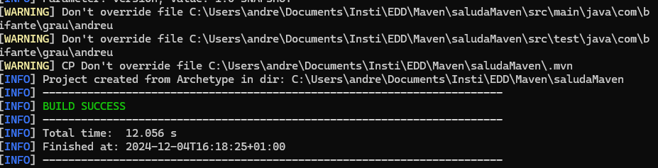
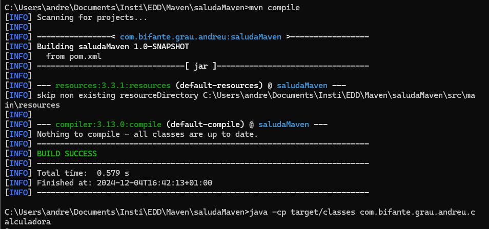
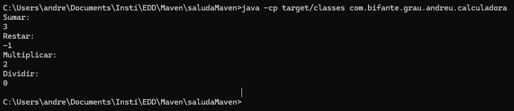
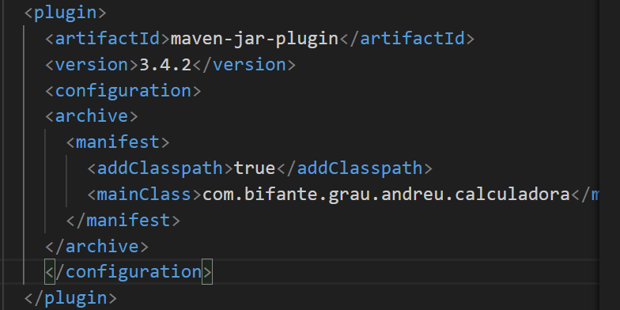
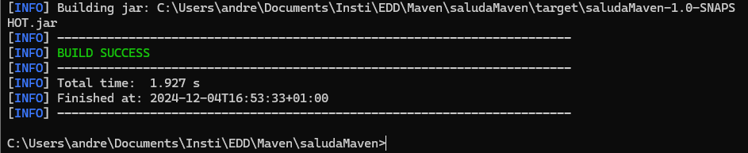
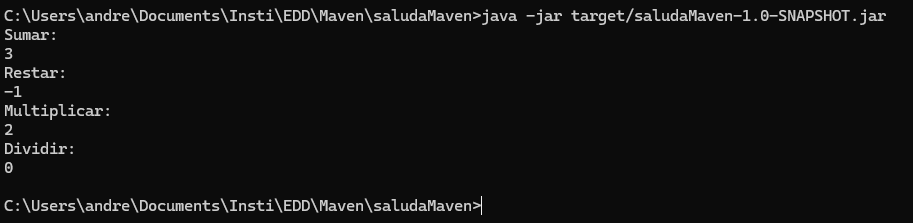
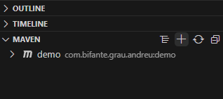
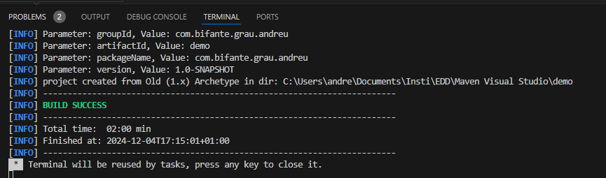
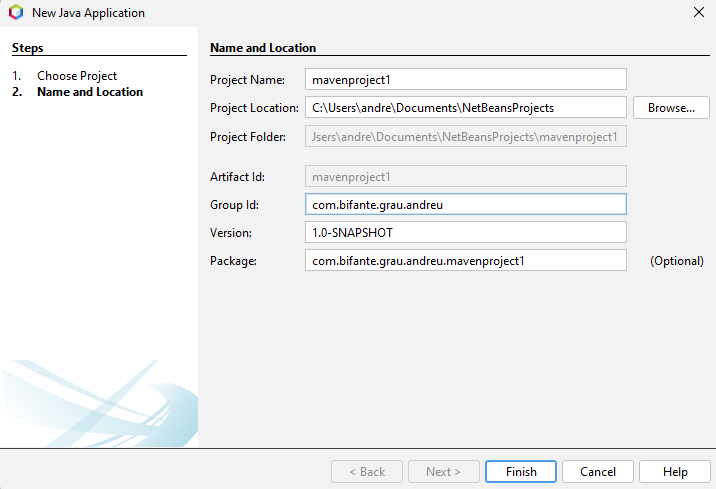

# Java con Maven

Vamos a crear un proyecto con Maven en terminal, en visual studio y con netbeans.

## Instalacion

Para instalar Java con Maven, nos vamos a su pagina oficial y nos descargamos el binario del programa. tras esto, añadimos la ruta al /bin del programa al $PATH. Con esto, ya podremos utilizar Maven donde queramos.

## Por terminal

Generamos el proyecto con el siguiente comando con la plantilla de un "Hola Mundo!"

> mvn archetype:generate -DgroupId=com.bifante.grau.andreu -DartifactId=saludaMaven -DarchetypeArtifactId=maven-archetype-quickstart -DarchetypeVersion=1.5 -DinteractiveMode=false
 

### Compilar

Pasamos los ficheros java de la calculadora y sus funciones y le cambiamos el package por:

> package com.bifante.grau.andreu;  

Cuando ya tengamos el programa hecho, en este caso la calculadora, lo ponemos en los directorios /main y /test le damos a:  

> mvn compile   

### Ejecutar

### Limpiar proyecto

> mvn clean

### Empaquetar

Antes de crear el JAR tenemos que cambiar el pom.xml para especificar la clase principal de la aplicacion.

Desde ahi, ya se podrá empaquetar sin problemas.

### Ejecutar JAR

  

## Por Visual Studio Code

Instalamos la extension *"Maven for Java"* y creamos el proyecto.

Desde aqui, es todo igual en cuanto a compilar y empaquetar. Utilizamos los comandos y la configuracion del pom.xml.

## NetBeans

En NetBeans es muy sencillo, simplemente le damos a crear nuevo proyecto y le damos a "Java with Maven".

Tras esto, hacemos la calculadora y cuando queramos compilarlo le damos click derecho al proyecto y le damos a "Build and clean" tras esto, te darán los .class y el JAR en la carpeta "tarjet".