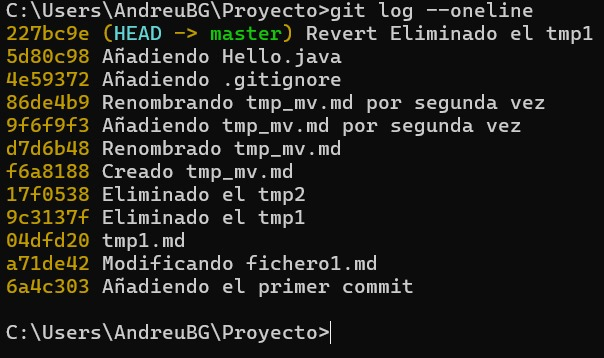

# Git
## Guia de instalacion y uso de git

### Inicializar repositorio git

> git init

Cambios: Se crea carpeta .git

### Ver estado del git

> git status

### Añadir ficheros

> git add .

Cambios : los ficheros pasan de "untracked" a "staged"

### Guardar los cambios (commit)

> git commit -m "Mensaje"

Cambios: Se guardan los ficheros en el repositorio

### Configurar datos proyecto

> git config --global user.name "Andreu"  

> git config --global user.email "andreueljust@gmail.com"

### Eliminar ficheros

> rm fichero  
> git add . // git rm
  
> git restore  

## Ejercicio 1
**Prueba a modificar un archivo y ver que pasa**

Si lo modificamos se pone en modo "modified" y lo podremos añadir al prepositorio con un `git commit -m `

**Que hace la opcion -a del git commit?**  

Con esta opcion podemos hacer un commit añadiendo todos los documentos automaticamente como si hicieramos un `git add .`

## Ejercicio 2
> touch tmp1.md tmp2.md
1. Primero estan `untracked`
> git add .
2. Luego pasan a estar `staged`
> git commit -m "Mensaje"
3. Finalmente pasan a estar `tracked`

## Ejercicio 3
Creamos un fichero .gitignore con el siguiente contenido:
> *.class -> *Le estamos diciendo que ignore todos los ficheros con la extension .class*
  
Compilamos y haemos un ```git add .``` y nos dirá que se ignorará el fichero .class y que podemos usar la opcion -f para añadir los archivos sin tener en cuenta el .gitignore.


## Log
